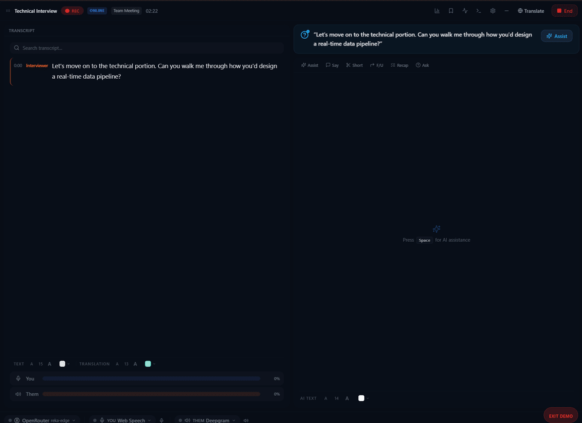
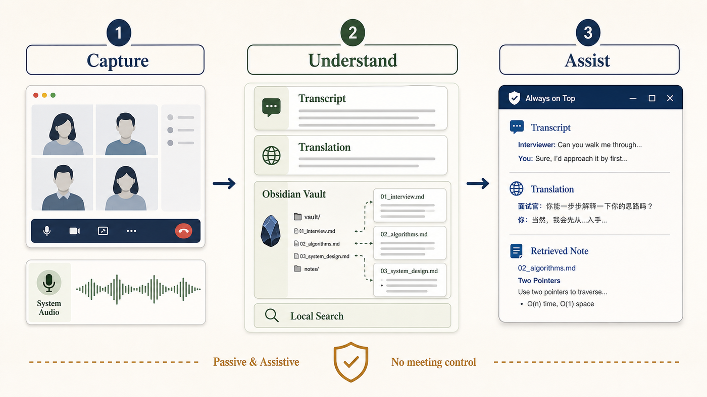

<p align="center">
  
</p>
<p align="center">
  <strong>AI Meeting Assistant & Real-Time Interview Copilot</strong>
</p>

<p align="center">

[](https://github.com/VahidAlizadeh/NexQ/releases/latest)
[](LICENSE)
[](https://github.com/VahidAlizadeh/NexQ/actions/workflows/release.yml)
[](https://github.com/VahidAlizadeh/NexQ/releases)
[](https://github.com/VahidAlizadeh/NexQ/releases/latest)
[](https://v2.tauri.app/)
[](https://react.dev/)
[](https://www.rust-lang.org/)
[](https://www.typescriptlang.org/)
[](CONTRIBUTING.md)

</p>

<p align="center">
  
</p>
<p align="center"><em>NexQ overlay during a live interview — real-time transcription and AI suggestions</em></p>

<p align="center">
  
</p>
<p align="center"><em>System-audio loopback, live transcription, bilingual translation, and local knowledge retrieval in one assistive overlay</em></p>

### Why NexQ?

🔒 **Local-first** — personal files, indexes, sessions, and recordings stay local; cloud services are opt-in

🆓 **Free & Open Source** — no subscriptions, no limits, ever

⚡ **10 STT + 9 LLM providers** — from local Whisper, Ollama, and Codex to cloud Deepgram & OpenAI

## Features

- **Dual-party transcription** — captures mic ("You") and system audio ("Them") simultaneously
- **Real-time AI copilot** — get streaming, speakable answers and follow-up suggestions from local Codex or other LLM providers
- **Local RAG pipeline** — index your own documents (PDF, DOCX, TXT, MD) for context-aware AI responses
- **Obsidian Vault import** — bring a local Markdown Vault into the knowledge base without an Obsidian plugin
- **Interview Query Router** — automatically choose direct Codex, local files, or web search and show source/confidence metadata
- **Interview preparation + review** — check devices/services before starting, save bilingual transcripts, and write a dated review back to Obsidian
- **Mock Interview** — text-only practice with follow-up questions and coaching across technical accuracy, English, structure, confidence, and profile consistency
- **Gemini Context Cache** — upload documents to Gemini once, skip local embedding entirely for ~3-5s faster queries
- **10 STT providers** — Web Speech API, Deepgram, Groq, Whisper, ONNX Runtime, and more
- **Always-on-top overlay** — compact, transparent floating window visible only to you
- **Bookmarks & action items** — pin key moments and auto-extract tasks
- **Speaker labeling** — identify and name each speaker in the transcript
- **Multi-language translation** — real-time translation via 5 providers (100+ languages)
- **Audio recording & playback** — record meetings as WAV, replay with synced transcript
- **Meeting scenarios** — pre-configured templates for interviews, lectures, and team meetings

## Quick Start

1. **Download** the [latest release](https://github.com/VahidAlizadeh/NexQ/releases/latest)
2. **Configure** your STT and LLM providers. If the local Codex CLI is installed and authenticated, NexQ can use its `codex app-server` session without another API key.
3. **Prepare interview** to verify the selected microphone, system output, STT, translation, knowledge base, and answer model.
4. **Start** a meeting — NexQ reads selected local audio and shows assistance in its overlay; it does not control, speak into, or type into the meeting app.

For live interviews, follow the meeting platform, school, and local consent rules for recording and AI assistance.

[Getting Started Guide](docs/user-guide/getting-started.md) | [All User Guides](docs/user-guide/)

## Gemini Context Cache

For users running NexQ on a laptop without a dedicated GPU, local embedding can add 2–5 seconds of latency per AI query. The **Gemini Context Cache** feature eliminates this entirely.

Instead of embedding documents locally via Ollama on every query, NexQ uploads your context documents to Gemini's servers once per meeting session. Gemini pre-processes and stores the KV state. Every subsequent query skips local embedding completely — only the live transcript and your question are sent fresh.

**Setup:**
1. Load your context documents (PDF, DOCX, TXT) in the Context panel
2. Go to **Settings → Context Strategy**
3. Select **Gemini Context Cache**
4. Choose your model and TTL, then click **Create Cache from Context Docs**

**Requirements:** Google Gemini API key, documents loaded in context.

**Speed comparison (CPU-only laptop):**

| Mode | Per-query overhead | Notes |
|------|-------------------|-------|
| Local RAG (`all-minilm`) | ~1–2s | Fastest local option |
| Local RAG (`nomic-embed-text`) | ~3–5s | Default model |
| **Gemini Context Cache** | **~0s** | No local embedding at all |

Cache expires after your chosen TTL (30 min – 24 hours). Delete it early from the same settings panel.

## Why NexQ vs. Others?

| | NexQ | Otter.ai | Granola | Krisp |
|---|:---:|:---:|:---:|:---:|
| **Price** | **Free** | $8+/mo | $18/mo | $16/mo |
| **100% Local** | Yes | No | Partial | Partial |
| **Open Source** | Yes | No | No | No |
| **No Bot Joins** | Yes | No | Yes | Yes |
| **STT Providers** | **10** | 1 | 1 | 1 |
| **LLM Providers** | **8** | 1 | 1 | 1 |
| **Local LLM** | Yes | No | No | No |
| **RAG / Doc Context** | Yes | No | No | No |

## Screenshots

| Live Interview | Lecture Mode | Past Meeting Review |
|:---:|:---:|:---:|
|  |  |  |

## Tech Stack

| Layer | Technology |
|-------|-----------|
| Desktop | Tauri 2 (Rust + WebView2) |
| Frontend | React 18, TypeScript 5.5, Vite 6 |
| State | Zustand 4.5 |
| Styling | Tailwind CSS 3.4, shadcn/ui |
| Audio | cpal, WASAPI (Windows loopback) |
| STT | whisper-rs, ONNX Runtime, Deepgram, Groq, Web Speech API |
| LLM | Local Codex app-server, OpenAI, Anthropic, Groq, Ollama, LM Studio, Gemini |
| Database | SQLite (rusqlite) |

## Development

### Prerequisites

- [Node.js](https://nodejs.org/) 20+
- [Rust](https://www.rust-lang.org/tools/install) (stable toolchain)
- [Tauri CLI](https://v2.tauri.app/start/prerequisites/) (`npm install -g @tauri-apps/cli`)

### Setup

```bash
# Clone the repository
git clone https://github.com/VahidAlizadeh/NexQ.git
cd NexQ

# Install frontend dependencies
npm install

# Run in development mode (launches Rust backend + React frontend)
npx tauri dev

# Build production installer
npx tauri build
```

### Other Commands

```bash
npm run dev       # Vite dev server only (port 5173)
npm run build     # TypeScript check + Vite production build
```

## Windows SmartScreen

When you first run NexQ, Windows SmartScreen may display a warning. This is normal for open-source applications that are not code-signed. To proceed:

1. Click **"More info"**
2. Click **"Run anyway"**

Code signing certificates are expensive and not feasible for most open-source projects. The application is safe to run — you can verify by building from source.

## Contributing

Contributions welcome! See [CONTRIBUTING.md](CONTRIBUTING.md) for guidelines.

## License

[MIT License](LICENSE) — free forever.

## Acknowledgments

- [Tauri](https://tauri.app/) — desktop application framework
- [React](https://react.dev/) — user interface library
- [whisper-rs](https://github.com/tazz4843/whisper-rs) — Rust bindings for OpenAI Whisper
- [Deepgram](https://deepgram.com/) — speech-to-text API
- [shadcn/ui](https://ui.shadcn.com/) — UI component library
